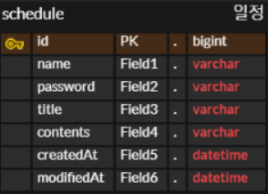

# 일정 관리 앱

## API 명세서
| 기능            | Method | URL                 | Request                                                                            | Response                                                                                                                 | Status Code                                                                                                                                        |
|---------------|--------|---------------------|------------------------------------------------------------------------------------|--------------------------------------------------------------------------------------------------------------------------|----------------------------------------------------------------------------------------------------------------------------------------------------|
| 스케줄 등록        | POST | /api/schedules      | {"name" : "이름", "password" : "비밀번호", "title" : "제목", "contents" : "할일"} |                                                                                                                          | 응답 성공 시200 OK name, password, title, contents 중 하나라도 누락 시 : 400 BAD REQUEST                                                                    |
 | 스케줄 단건 조회     | GET | /api/schedules/{id} |                                                                                    | {"id" : "식별자" "title" : "제목" "contents" : "할일" "createdAt" : "작성 시간" "modifiedAt" : "수정 시간"}             | 응답 성공 시 : 200 OK DB에 없는 아이디 입력 시 : 404 NOT FOUND                                                                                               |
| 스케줄 전체 조회     | GET | /api/schedules |                                                                                    | [ {"id" : "식별자" "title" : "제목" "contents" : "할일" "createdAt" : "작성 시간" "modifiedAt" : "수정 시간"} ] | 200 OK                                                                                                                                             |
 | 스케줄 이름, 할일 수정 | PUT | /api/schedules/{id} | {"name" : "이름", "contents" : "할일", "password" : "비밀번호"}                    |                                                                                                                          | 응답 성공 시 : 200 OK  DB에 없는 id 입력 시 : 404 NOT FOUND  name, contents, password 입력 하나라도 누락 시 : 400 BAD REQUEST  비밀번호 틀릴 시 : 400 BAD REQUEST |
 | 스케줄 제목 수정     | PATHCH | /api/schedules/{id}  | {"title" : "제목", "password" : "비밀번호"                                           |                                                                                                                          | 응답 성공 시 : 200 OK  DB에 없는 id 입력 시 : 404 NOT FOUND  name, contents, password 입력 하나라도 누락 시 : 400 BAD REQUEST  비밀번호 틀릴 시 : 400 BAD REQUEST |
 | 스케줄 단건 삭제     | DELETE | /api/schedules/{id} | {"password" : "비밀번호"}                                                              | | 응답 성공 시 200 OK DB에 없는 id 입력 시 : 404 NOT FOUND 비밀번호 틀릴 시 : 400 BAD REQUEST                                                                  |
 

## ERD
